&nbsp;

[//]: # (<p align="center">  </p>)

# ✨ Image Crop Comparator

Image Crop Comparator (ICC): A research-oriented, interactive image crop comparator for pixel-level method analysis, designed for a fast and flexible interactive workflow with multi-ROI selection, automatic layout arrangement, and rich customization options.

<div align="center">

[]()

</div>

## 📌 Overview

### ✨ Features
- ROI-based visual comparison for image restoration (or other else) tasks
- Fast and flexible multi-ROI selection via keyboard and mouse, with undo/redo support
- Automatic layout arrangement (left / right / top / bottom)
- Support for multiple workspace structures
- Highly customizable CLI for future research, and a user-friendly Web interface (gradio) for improved usability

### 🆕 News 

- **2025.12.30** A quick demo of our tool is available on [Hugging Face](). 🤗
- **2025.12.29** Update [basic tutorial](#workflows). 🧾
- **2025.12.27** Update ICC-CLI original-version, a runnable command-line (CLI) tool, including local/external sources, ROI selection, layout preview, and export. The compatible. 🎈

## 📑 Contents
- 🚀 Getting Started
  - [Installation](#installation)
  - [Quick Start](#quick-start)
  - [Workspace Layout](#workspace-layout)
- 🧭 User Guide
  - [Workflows](#workflows)
  - [Interaction](#interaction)
  - [Usage](#usage)
  - [Saving](#saving)
- ⚙️ Reference
  - [CLI Options](#cli-options)
  - [Logs](#logs)
  - [Troubleshooting](#troubleshooting)
- 🤝 Community
  - [Contributing](#contributing)
  - [Acknowledgements](#acknowledgements)

## 🚀 Getting Started

<a id="installation"></a>
### 🧰 Installation
- Python 3.8+
- [requirements.txt](requirements.txt) pins `opencv-python==4.7.*` and `numpy==1.26.*`; install with `pip install -r requirements.txt`.
- Packages: opencv-python, numpy, natsort, Pillow

```bash
# Conda (recommended)
conda create -n crop-comparer python=3.10 -y  # python>=3.8 (e.g. 3.9) is also supported, and python<=3.12 is recommended
conda activate crop-comparer
pip install -r requirements.txt
```

<details>
<summary>venv alternative</summary>

```bash
python -m venv .venv
source .venv/bin/activate  # Windows: .venv\\Scripts\\activate
pip install -r requirements.txt
```

</details>

<a id="quick-start"></a>
### 🚀 Quick Start
```bash
python compare.py
```

<a id="workspace-layout"></a>
### 🗂️ Workspace Layout
(for default local source)
Methods live under the workspace root, and each holds datasets.

```
<root>/
  <method>/
    <dataset>/
      <images...>
```

<details>
<summary>Example</summary>

```
examples/         # <root>
  A-Net/          # <method>
    LOL-v2-real/  # <dataset>
      00698.png   # <images...>
      00775.png
    SDSD-indoor/
      00101.png
      00259.png
  B-Former/
    LOL-v2-real/
      00698.png
      00775.png
    SDSD-indoor/
      00101.png
      00259.png
  ...
```

</details>

<details open>
<summary>Supported structures (use `--structure`)</summary>

- `group-dataset-pair`: `<root>/<method>/<group>/<dataset>/<pair>/.png`
- `group-dataset` (default classic): `<root>/<method>/<group>/<dataset>/.png`
- `dataset-only`: `<root>/<method>/<dataset>/.png`
- `flat`: `<root>/<method>/.png`
- `shared`: `<root>/<image-id>/<method>.png`
- `auto` (default): tries the above in order.

</details>

<details>
<summary>Structure examples</summary>

1. `group-dataset-pair` (deep): `<root>/<method>/<group>/<dataset>/<pair>/.png`
```
<root>/
  <method1>/
    <group>/
      <dataset>/
        <pair>/
          <img1.png>
          <img2.png>
          ...
          <imgn.png>
  <method2>/
    <group>/
      <dataset>/
        <pair>/
          <img1.png>
          <img2.png>
          ...
          <imgn.png>
```

2. `group-dataset` (default classic): `<root>/<method>/<group>/<dataset>/.png`
```
<root>/
  <method1>/
    <group>/
      <dataset>/
        <img1.png>
        <img2.png>
        ...
        <imgn.png>
  <method2>/
    <group>/
      <dataset>/
        <img1.png>
        <img2.png>
        ...
        <imgn.png>
```

3. `dataset-only`: `<root>/<method>/<dataset>/.png` (example of current default for local source)
```
<root>/
  <method1>/
    <dataset>/
      <img1.png>
      <img2.png>
      ...
      <imgn.png>
  <method2>/
    <dataset>/
      <img1.png>
      <img2.png>
      ...
      <imgn.png>
```

4. `flat` (images directly under method): `<root>/<method>/.png`
```
<root>/
  <method1>/
    <img1.png>
    <img2.png>
    ...
    <imgn.png>
  <method2>/
    <img1.png>
    <img2.png>
    ...
    <imgn.png>
```

5. `shared` (per-image folders contain per-method files): `<root>/<image-id>/<methodA>.png, <methodB>.png, ...`
```
<root>/
  <img1>/
    <method1.png>
    <method2.png>
    ...
    <methodn.png>
  <img2>/
    <method1.png>
    <method2.png>
    ...
    <methodn.png>
```

6. `auto` (default): tries the above in order until images are found.

</details>

## 🧭 User Guide

<a id="workflows"></a>
### 🧪 Workflows
<details open>
<summary>Quick tutorial</summary>

Short walkthrough showing ROI selection.

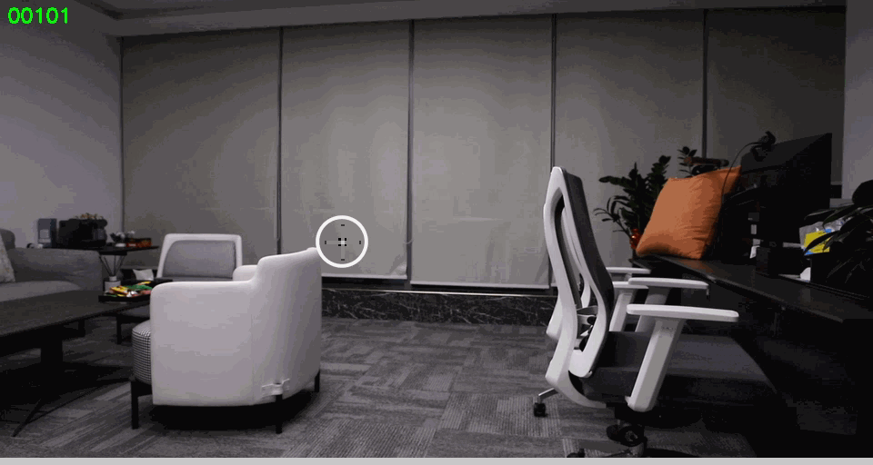

</details>

<details open>
<summary>Basic ROI operations</summary>

| Select ROI                                  | Move ROI                                | Add ROI                                    |
|---------------------------------------------|-----------------------------------------|--------------------------------------------|
| 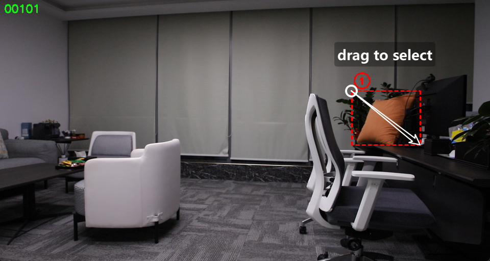 | 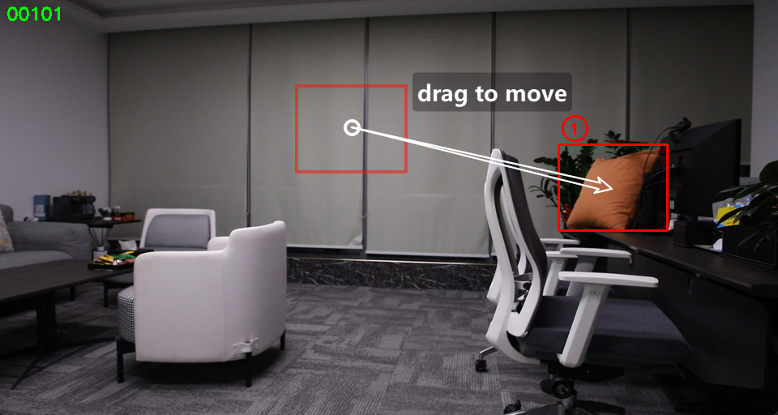 |  |

| Reselect ROI                                    | Delete ROI                                  |
|-------------------------------------------------|---------------------------------------------|
| 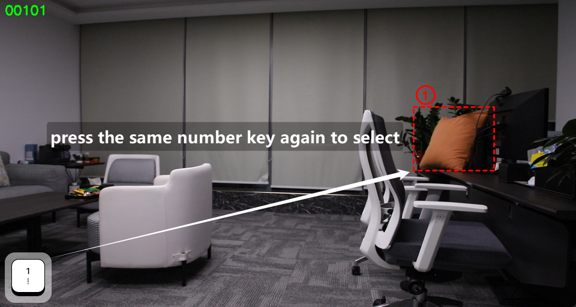 | 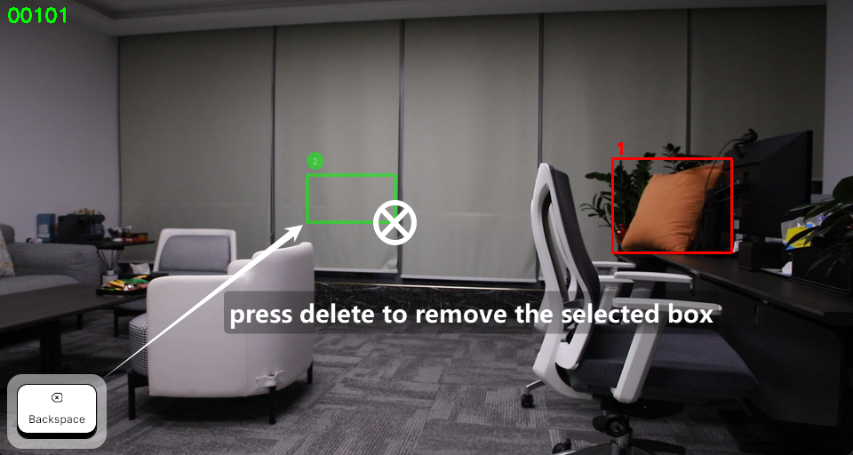 |

</details>

<details>
<summary>Layout directions</summary>

| Layout left                                 | Layout right                                  | Layout top                               | Layout bottom                                   |
|---------------------------------------------|-----------------------------------------------|------------------------------------------|-------------------------------------------------|
| 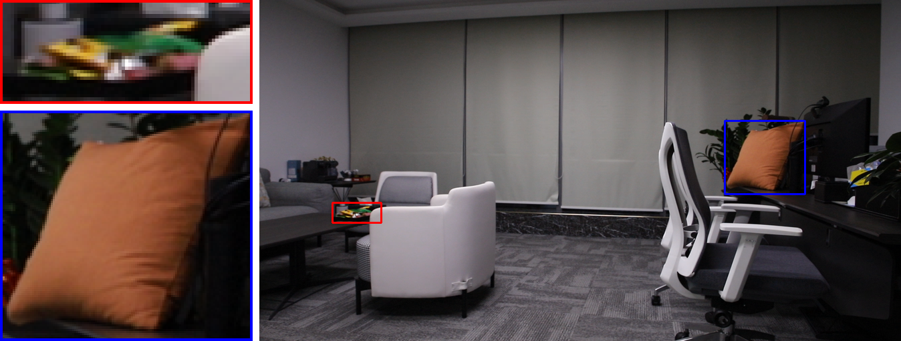 | 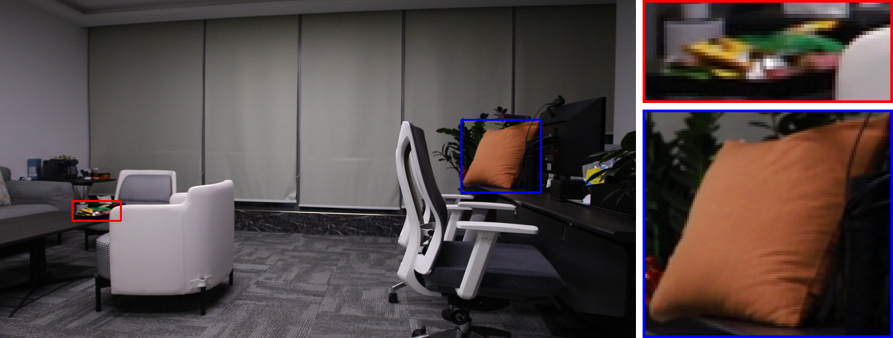 | 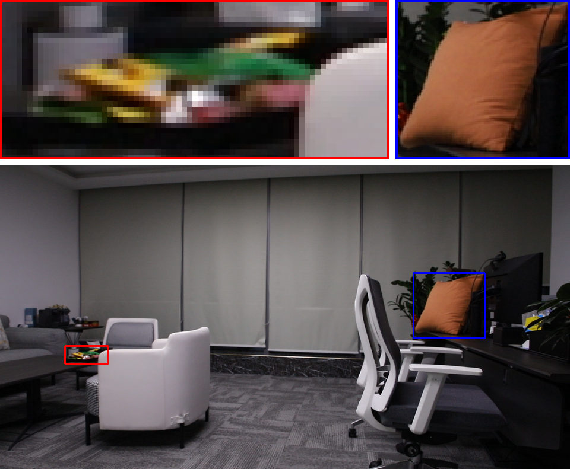 | 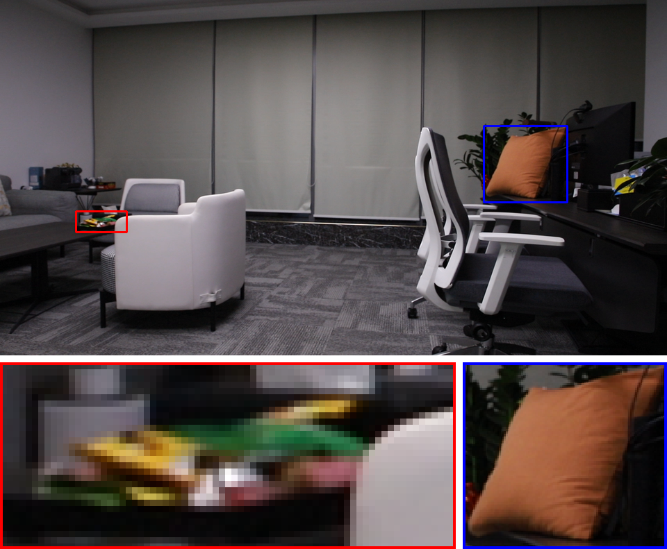 |

</details>

<details>
<summary>Layout capacities</summary>

| Single ROI (one)                      | Two ROIs                              | Three ROIs                                | More than three ROIs                    |
|---------------------------------------|---------------------------------------|-------------------------------------------|-----------------------------------------|
| 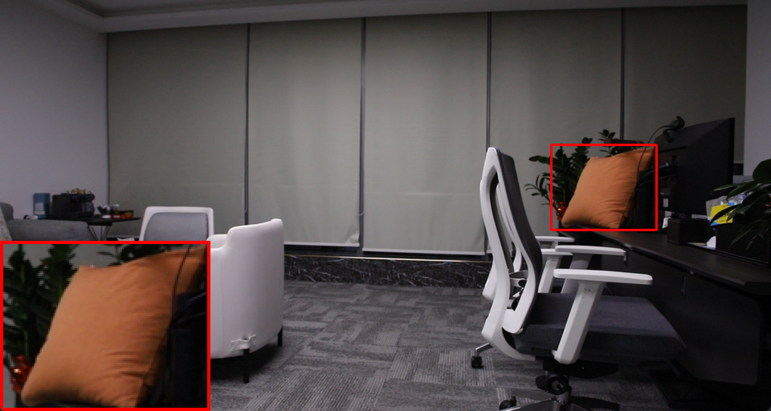 |  | 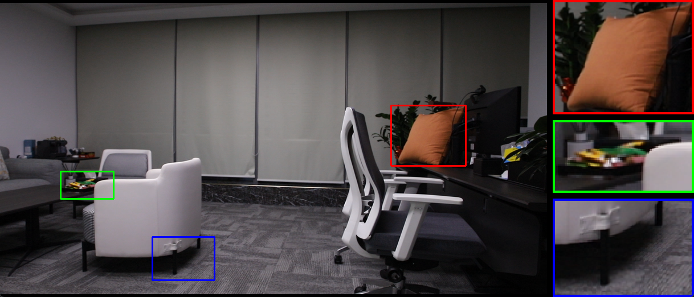 | 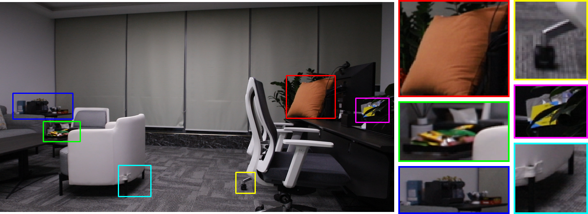 |

</details>

<details>
<summary>Mouse-only quick tour</summary>

Optional mouse-only quick tour (all operations by mouse):


</details>


<a id="interaction"></a>
### 🎮 Interaction

<details open>
<summary>Keyboard</summary>

|      Key      | Action                                                          |
|:-------------:|-----------------------------------------------------------------|
|      `a`      | Add smallest unused ROI                                         |
|     `1–9`     | Add / select ROI by id; Tapping active id enters selection mode |
|  `Shift+1–9`  | Duplicate active ROI to target id or copy its size              |
|      `d`      | Add ROI with active size                                        |
|   `← ↑ → ↓`   | Change layout direction                                         |
|    `z / y`    | Undo / redo                                                     |
|    `Enter`    | Switch dataset (`group/dataset` or `dataset`)                   |
|    `Space`    | Jump to image by name                                           |
|    `n / p`    | Next / previous image                                           |
|      `s`      | Save outputs                                                    |
|      `i`      | Toggle idle (hide/show grids)                                   |
|      `r`      | Clear all ROIs                                                  |
|   `q / Esc`   | Quit                                                            |

> Note: Arrow keys (`← ↑ → ↓`) control the layout direction, not ROI movement. 
> ROI movement is performed by mouse dragging in position mode.

</details>

<details open>
<summary>Mouse</summary>

- Draw in selection mode; drag to reposition in position mode.
- Hold `Shift` while drawing a ROI: constrain to a square using the longer side.

Quick actions:
- Right-click on overlapping ROIs: cycle to the next higher id in that stack (wraps to smallest).
- Right-click outside any ROI: add the next ROI (same as `a`).
- Right-click down inside a ROI, release after the cursor leaves that ROI: delete it.
- Middle-button inside the active ROI: duplicate it to a new ROI, then drag the new ROI while holding.
- Middle-button inside a non-active ROI: copy the active ROI size to that ROI (Shift+digit).

</details>


<a id="usage"></a>
### 🧭 Usage
Local images with auto-discovery:

```bash
python compare.py --source local --root <root> --group <group> --dataset <dataset> --layout right
```

<details>
<summary>External datasets</summary>

External (video-form) datasets require `timeline_methods.txt`:

```bash
python compare.py --source external --dataset SDSD-indoor --pair pair13 --layout left
```

</details>


<a id="cli-options"></a>
### ⚙️ CLI Options
<details open>
<summary>Core switches</summary>

- `--source`: `local` or `external`
- `--root`: workspace root (local)
- `--group`, `--dataset`, `--pair`: dataset selectors
- `--structure`: layout of files (see above)
- `--output`: output root directory

</details>

<details>
<summary>Display and layout</summary>

- `--layout`: `left|top|right|bottom`
- `--columns`: grid columns for per-ROI previews
- `--magnify` / `--scale`: display-only magnification (ignored for multi-ROI final)
- `--layout-padding`: padding between crops and base image
- `--display-thickness-mult`: overlay thickness multiplier for final layout

</details>

<details>
<summary>Interaction defaults</summary>

- `--mode`: `selection|position|idle`
- `--preview`: method key for final preview (`GT`/`input` if present)
- `--thickness`: ROI and crop border thickness

</details>

<details>
<summary>Logging</summary>

- `--log-level`: `debug|info|warn|error`
- `--no-color`: disable ANSI colors

</details>


<a id="saving"></a>
### 💾 Saving
On `s`, outputs are written to:

```
<output>/<timestamp>/<dataset>/<image-basename>/
  orig_<method>.png
  final_<method>.png
  crop_roi<id>_<method>.png
```

Each method writes its own originals, composed final previews, and all crops for active ROIs.

## ⚙️ Reference

<a id="logs"></a>
### 🎨 Logs
- Linux terminals show colored status messages: info (cyan), success (green), warnings (yellow), errors (red), notes (bright cyan).
- Toggle with `--no-color`; set verbosity via `--log-level`.

<a id="troubleshooting"></a>
### 🛠️ Troubleshooting
- "Folder has no images": check dataset path and image extensions.
- "timeline_methods.txt is required": needed for `--source external`.
- GUI not responsive: ensure OpenCV GUI support; on headless servers use a local machine or X-forwarding.

## 🤝 Community

<a id="contributing"></a>
### 🤝 Contributing

Contributions are welcome!

- Please open an issue for bugs or feature requests.
- For major changes, discuss first via an issue.
- Keep PRs focused and well-documented.
- Follow existing code style and naming conventions.

<a id="acknowledgements"></a>
### 🙏 Acknowledgements
Built for fast LLIE evaluation workflows.
