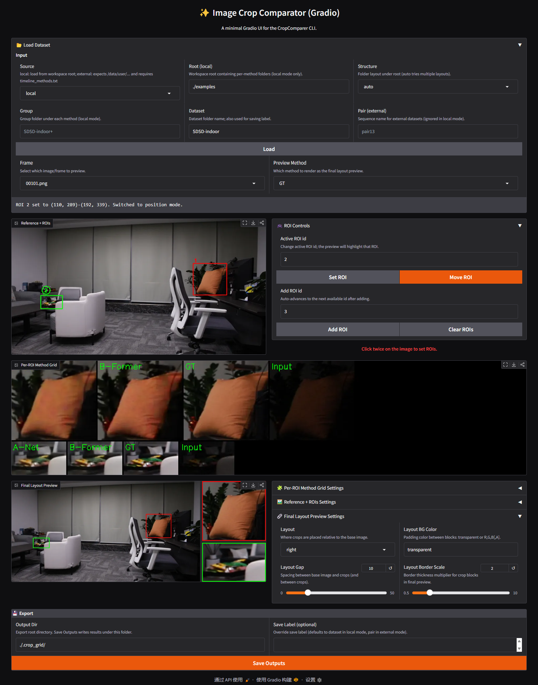

&nbsp;

<p align="center">  </p>

# ✨ 图像裁剪对比工具 (Image Crop Comparator)

图像裁剪对比工具（ICC）：用于像素级方法对比分析的交互式裁剪对比工具。将结果图放入指定目录后按默认参数启动，即可快速框选 ROI、并排对比不同方法的局部细节；支持自动排版、撤回/重做、多 ROI 管理等功能。

<div align="center">

[](https://huggingface.co/spaces/OrangeC4709/ImageCropComparator)

</div>

<div align="center">

🌐 **语言**： [English](README.md) | 简体中文

</div>

<details>
<summary>图像裁剪对比工具演示</summary>



</details>

## 概览 📌

### 主要特性 ✨
- ROI 多图对比预览（图像恢复等视觉任务）
- 鼠标/键盘快捷操作的多 ROI 选择与管理，支持撤回/重做
- 自动排版（左 / 右 / 上 / 下），适配多 ROI 并排查看
- 支持多种工作空间目录结构，并提供自动寻找匹配
- 提供可高度定制的 CLI，同时支持更易上手的 Gradio Web 界面

### 新闻 🆕 

- **2025.12.30** 在 [Hugging Face](https://huggingface.co/spaces/OrangeC4709/ImageCropComparator) 上线在线演示。🤗
- **2025.12.30** 上线 Web 版本（Gradio UI），更易上手。🚀
- **2025.12.29** 更新[基础教程](#教程)。🧾
- **2025.12.28** 发布 ICC-CLI 初版：可运行的命令行工具，支持本地/外部数据源、ROI 选择、排版预览与导出。🎈

## 目录 📑 
- 快速开始 🚀
  - [安装](#安装)
  - [快速开始 (CLI)](#快速开始-cli)
  - [快速开始 (Gradio)](#快速开始-gradio)
  - [工作空间布局](#工作空间布局)
- 用户指南 🧭
  - [教程](#教程)
  - [交互操作](#交互操作)
  - [使用方法](#使用方法)
  - [输出](#输出)
- 参考文档 ⚙️ 
  - [CLI选项](#cli选项)
  - [日志](#日志)
  - [常见问题](#常见问题)
- 社区 🤝 
  - [号召](#号召)

## 快速开始 🚀

<a id="安装"></a>
### 安装 🧰
- Python 3.8+
- 使用 `pip install -r requirements.txt` 安装第三方包。
- 主要依赖：opencv-python, numpy, natsort, Pillow

```bash
# Conda (推荐)
conda create -n crop-comparer python=3.10 -y  # 支持 python>=3.8 (如3.9)，推荐 python<=3.12
conda activate crop-comparer
pip install -r requirements.txt
```

<details>
<summary>venv 方案</summary>

```bash
python -m venv .venv
source .venv/bin/activate  # Windows: .venv\\Scripts\\activate
pip install -r requirements.txt
```

</details>

<a id="快速开始-cli"></a>
### 快速开始 (CLI) 🚀
```bash
python compare.py
```
- **两步**流程：
  1) 将各方法的结果图 `results/img.png[...]` 放入 `examples/`（或自定义根目录）。
  2) 直接运行 `python compare.py`（默认参数），开始框选 ROI 并对比。
- 如果要更改文件夹路径，可以在 UI 或命令行中调整 `Root`/`Structure`。

<a id="快速开始-gradio"></a>
### 快速开始 (Gradio) 🚀
```bash
python gradio_app.py
```
- 运行指令以后，默认会在 http://127.0.0.1:7860/ 启动 Gradio 界面，点击链接即可。

<a id="工作空间布局"></a>
### 工作空间布局 🗂️
（适用于默认本地数据源）
方法文件夹位于工作空间根目录，每个方法下包含多个数据集。

```
<root>/
  <method>/
    <dataset>/
      <images...>
```

<details>
<summary>示例</summary>

```
examples/         # <root>
  A-Net/          # <method>
    LOL-v2-real/  # <dataset>
      00698.png   # <images...>
      00775.png
    SDSD-indoor/
      00101.png
      00259.png
  B-Former/
    LOL-v2-real/
      00698.png
      00775.png
    SDSD-indoor/
      00101.png
      00259.png
  ...
```

</details>

<details open>
<summary>支持的文件夹结构（使用 `--structure`）</summary>

- `group-dataset-pair`: `<root>/<method>/<group>/<dataset>/<pair>/.png`
- `group-dataset` (经典默认): `<root>/<method>/<group>/<dataset>/.png`
- `dataset-only`: `<root>/<method>/<dataset>/.png`
- `flat`: `<root>/<method>/.png`
- `shared`: `<root>/<image-id>/<method>.png`
- `auto` (默认): 按顺序尝试上述结构，直到找到图像。

</details>

<details>
<summary>结构示例</summary>

1. `group-dataset-pair` (深层): `<root>/<method>/<group>/<dataset>/<pair>/.png`
```
<root>/
  <method1>/
    <group>/
      <dataset>/
        <pair>/
          <img1.png>
          <img2.png>
          ...
          <imgn.png>
  <method2>/
    <group>/
      <dataset>/
        <pair>/
          <img1.png>
          <img2.png>
          ...
          <imgn.png>
```

2. `group-dataset` (经典默认): `<root>/<method>/<group>/<dataset>/.png`
```
<root>/
  <method1>/
    <group>/
      <dataset>/
        <img1.png>
        <img2.png>
        ...
        <imgn.png>
  <method2>/
    <group>/
      <dataset>/
        <img1.png>
        <img2.png>
        ...
        <imgn.png>
```

3. `dataset-only`: `<root>/<method>/<dataset>/.png` (当前本地数据源默认)
```
<root>/
  <method1>/
    <dataset>/
      <img1.png>
      <img2.png>
      ...
      <imgn.png>
  <method2>/
    <dataset>/
      <img1.png>
      <img2.png>
      ...
      <imgn.png>
```

4. `flat` (图像直接放在方法文件夹): `<root>/<method>/.png`
```
<root>/
  <method1>/
    <img1.png>
    <img2.png>
    ...
    <imgn.png>
  <method2>/
    <img1.png>
    <img2.png>
    ...
    <imgn.png>
```

5. `shared` (图像ID文件夹包含各方法图像): `<root>/<image-id>/<methodA>.png, <methodB>.png, ...`
```
<root>/
  <img1>/
    <method1.png>
    <method2.png>
    ...
    <methodn.png>
  <img2>/
    <method1.png>
    <method2.png>
    ...
    <methodn.png>
```

6. `auto` (默认): 按顺序尝试上述结构，直到找到图像。

</details>

## 用户指南 🧭

<a id="教程"></a>
### 教程 🧪
<details open>
<summary>快速教程</summary>

ROI选择的简要演示。


</details>

<details open>
<summary>基础ROI操作</summary>

| 选择ROI                                 | 移动ROI                                 | 添加ROI                                      |
|-----------------------------------------|-----------------------------------------|----------------------------------------------|
|  |  |  |

| 重新选择ROI                                    | 删除ROI                                  |
|-------------------------------------------------|---------------------------------------------|
|  |  |

</details>

<details>
<summary>排版方向</summary>

| 左侧排版                                 | 右侧排版                                  | 上侧排版                               | 下侧排版                                   |
|---------------------------------------------|-----------------------------------------------|------------------------------------------|-------------------------------------------------|
|  |  |  |  |

</details>

<details>
<summary>排版容量</summary>

| 单个ROI                     | 两个ROI                              | 三个ROI                                | 三个以上ROI                      |
|--------------------------------------|---------------------------------------|-------------------------------------------|-------------------------------------------|
|  |  |  |    |

</details>

<details>
<summary>鼠标操作演示</summary>

可选：纯鼠标操作演示（所有操作仅用鼠标完成）：


</details>

<a id="交互操作"></a>
### 交互操作 🎮

<details open>
<summary>键盘快捷键</summary>

|      按键      | 操作                                 |
|:-------------:|------------------------------------|
|      `a`      | 添加新ROI                             |
|     `1–9`     | 按ID添加/选择ROI；点击活跃ID重新选择             |
|  `Shift+1–9`  | 复制活跃ROI到目标ID或复制其大小                 |
|      `d`      | 用活跃大小添加ROI                         |
|   `← ↑ → ↓`   | 改变排版方向                             |
|    `z / y`    | 撤回 / 重做                            |
|    `Enter`    | 切换数据集（`group/dataset` 或 `dataset`） |
|    `Space`    | 按名称跳转到图像                           |
|    `n / p`    | 上一张 / 下一张图像                        |
|      `s`      | 保存输出                               |
|      `i`      | 切换空闲模式（隐藏/显示网格）                    |
|      `r`      | 清空所有ROI                            |
|   `q / Esc`   | 退出                                 |

> 注意：方向键（`← ↑ → ↓`）控制的是排版方向，不是ROI移动。 
> ROI移动要通过在位置模式下使用鼠标拖拽完成。

</details>

<details open>
<summary>鼠标操作</summary>

- 在选择模式下拖拽绘制框；在位置模式下拖拽移动框。
- 绘制ROI时按住 `Shift` 则会强制框为正方形。

快速操作：
- 右键点击重叠的ROI：选择重叠区域内的下一个框。
- 右键点击ROI外：添加ROI（和按键 `a` 的功能一样）。
- 在ROI内按住右键，然后离开该ROI，并释放鼠标，即可删除该ROI。
- 在选中的ROI内按中键：将选中的ROI复制为一个新的ROI。
- 在非选中的ROI内按中键：复制选中ROI的大小到该ROI（相当于 `Shift+数字键` 的功能）。

</details>

<a id="使用方法"></a>
### 使用方法 🧭
本地图像（自动寻找目录结构）：

```bash
python compare.py --source local --root <root> --group <group> --dataset <dataset> --layout right
```

<details>
<summary>外部数据集</summary>

外部数据集（视频序列形式）需要 `methods.txt`：

```bash
python compare.py --source external --dataset SDSD-indoor --pair pair13 --layout left
```

</details>

<a id="cli选项"></a>
### CLI选项 ⚙️
<details open>
<summary>核心开关</summary>

- `--source`: `local` 或 `external`
- `--root`: 工作空间根目录（本地模式）
- `--group`, `--dataset`, `--pair`: 数据集选择器
- `--structure`: 文件布局（见上述说明）
- `--output`: 输出根目录

</details>

<details>
<summary>显示和排版</summary>

- `--layout`: `left|top|right|bottom`
- `--columns`: 每ROI预览的网格列数
- `--magnify` / `--scale`: 显示放大倍数（多ROI最终输出忽略）
- `--layout-padding`: ROI和基础图像间的间距
- `--display-thickness-mult`: 最终排版的覆盖厚度倍数

</details>

<details>
<summary>交互默认值</summary>

- `--mode`: `selection|position|idle`
- `--preview`: 最终预览的方法键（如存在则为 `GT`/`input`）
- `--thickness`: ROI和裁剪边框厚度

</details>

<details>
<summary>日志</summary>

- `--log-level`: `debug|info|warn|error`
- `--no-color`: 禁用ANSI颜色

</details>

<a id="输出"></a>
### 输出 💾
按 `s` 时，输出文件写入到：

```
<output>/<timestamp>/<dataset>/<image-basename>/
  orig_<method>.png
  final_<method>.png
  crop_roi<id>_<method>.png
```

每个方法写入对应的原始图像、合成最终预览和所有活跃ROI的裁剪。

## 参考文档 ⚙️

<a id="日志"></a>
### 日志 🎨
- Linux终端显示彩色状态消息：信息（青色）、成功（绿色）、警告（黄色）、错误（红色）、备注（亮青色）。
- 使用 `--no-color` 禁用；通过 `--log-level` 设置详细程度。

<a id="常见问题"></a>
### 常见问题 🛠️

**问题：**
```
cv2.error: OpenCV(4.7.0) /io/opencv/modules/highgui/src/window.cpp:1266: error: (-2:Unspecified error) The function is not implemented. Rebuild the library with Windows, GTK+ 2.x or Cocoa support. If you are on Ubuntu or Debian, install libgtk2.0-dev and pkg-config, then re-run cmake or configure script in function 'cvDestroyAllWindows'
```
**解决方案：**

1. 卸载 `opencv-python-headless` 并重新安装 `opencv-python`：
    ```bash
    pip uninstall opencv-python-headless
    pip install "opencv-python==4.7.*"
    ```
2. 如果是 Linux，确保已安装 GTK：
    ```bash
    sudo apt-get install libgtk2.0-dev pkg-config
    ```

<a id="号召"></a>
## 号召 ⭐

* ⭐ 如果你喜欢这个项目，欢迎点个 Star。将帮助更多人发现这个项目并支持该项目发展。

[//]: # (## 🤝 社区)

[//]: # ()
[//]: # (<a id="贡献"></a>)

[//]: # (### 🤝 贡献)

[//]: # ()
[//]: # (我们欢迎各种形式的贡献，包括错误报告、功能请求、文档改进和代码贡献。)

[//]: # ()
[//]: # (<a id="致谢"></a>)

[//]: # (### 🙏 致谢)

[//]: # ()
[//]: # (我们感谢所有通过反馈、讨论和代码贡献帮助改进该项目的用户和贡献者。)

[//]: # ()
[//]: # (<a id="引用"></a>)

[//]: # (### 📚 引用)

[//]: # ()
[//]: # (该工具是以下研究工作的副产品。)

[//]: # (如果你发现 **Image Crop Comparator &#40;ICC&#41;** 对你的研究或实践有帮助，请考虑引用：)

[//]: # ()
[//]: # (```bibtex)

[//]: # (@inproceedings{xu2025urwkv,)

[//]: # (  title     = {URWKV: Unified RWKV Model with Multi-state Perspective for Low-light Image Restoration},)

[//]: # (  author    = {Xu, Rui and Niu, Yuzhen and Li, Yuezhou and Xu, Huangbiao and Liu, Wenxi and Chen, Yuzhong},)

[//]: # (  booktitle = {Proceedings of the IEEE/CVF Conference on Computer Vision and Pattern Recognition &#40;CVPR&#41;},)

[//]: # (  pages     = {21267--21276},)

[//]: # (  year      = {2025})

[//]: # (})
